项目中涉及到对淘宝，京东商品历史价格的数据采集，直接爬虫是获取不到历史数据的。需要借助第三方比价平台——[慢慢买](http://www.manmanbuy.com/)。慢慢买是全网比价平台，主要是通过实习爬取淘宝，京东，天猫等电扇购物平台，向用户提供多平台的商品价格比较。同时，慢慢买还提供历史价格查询的功能。作为一个爬虫平台，慢慢买在反爬虫上也是花费了不少心思。

<!--more-->

## Http抓包分析

首先，进入慢慢买历史价格查询平台，复制一个淘宝京东的链接进行查询。

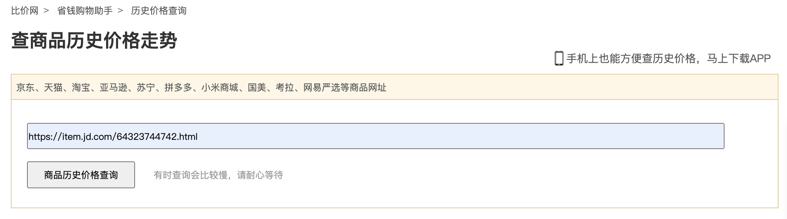

通过 Chrome 自带的开发者工具->Network 进行http抓包分析

1. 首先找到价格数据，价格数据中一定有238
2. 搜索所有请求到的资源，查看哪些有238
3. 找到对应的请求

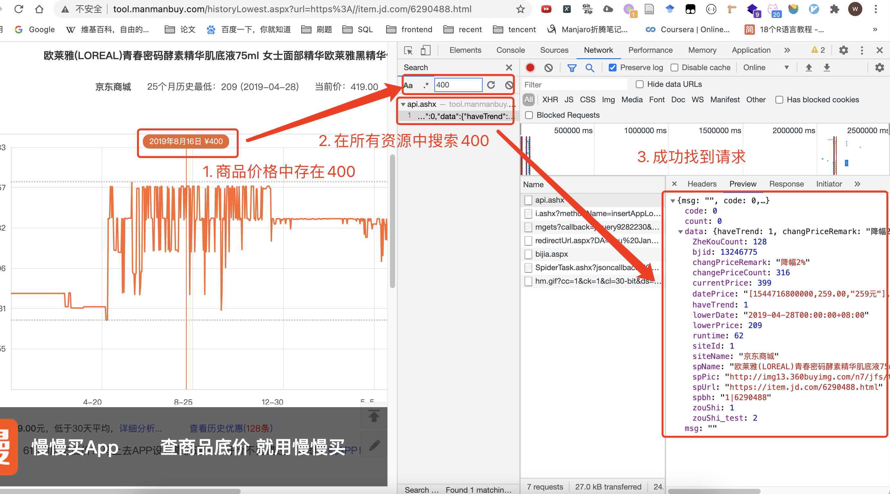

## 请求分析

通过查看 `Requests Headers` 的头部信息，发现这是一个POST请求，只要把参数填入 `From data`即可。

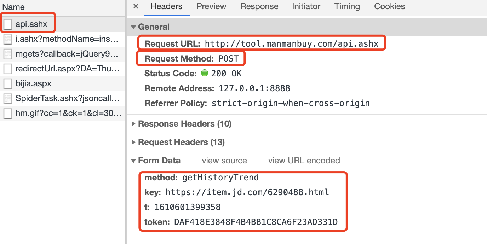

- 请求地址：http://tool.manmanbuy.com/api.ashx

- 请求方式：POST

- 请求数据：

  | Key    | Value                            | 含义             |
  | ------ | -------------------------------- | ---------------- |
  | method | getHistoryTrend                  | 固定不变         |
  | key    | https://item.jd.com/6290488.html | 原商品链接（变） |
  | t      | 1610601399358                    | 时间戳（变）     |
  | token  | DAF418E3848F4B4BB1C8CA6F23AD331D | token （变）     |

- 请求报文分析

  ```
  Accept: */*  # 接收所有类型的数据
  Accept-Encoding: gzip, deflate # 接收编码方式
  Accept-Language: zh-CN,zh;q=0.9,en-US;q=0.8,en;q=0.7 # 接收语言
  Authorization: BasicAuth D8DD2812A942776AF9ED750C2D6D7539BF204F7C0B0FB414E6CEBD28536A99D07304FA7BFFBB2BDD6B9B46823A9D19FA751316693F17DD79FF26D70E2EBA1BF31918AB09FC305FCFB80352187AE32269B8D8DB1977F84F1E # Basic 身份验证
  Content-Length: 122 # 内容长度
  Content-Type: application/x-www-form-urlencoded; charset=UTF-8 # 报文主体的类型：通过 x-www-form-urlencoded 提交主体
  Cookie: _ga=GA1.2.614520810.1610543725; _gid=GA1.2.187844233.1610543725; Hm_lvt_85f48cee3e51cd48eaba80781b243db3=1608561378,1608561379,1610539536,1610594558; ASP.NET_SessionId=oyiwn2k5xvhc2d5s3owcy4ma; radius=115.174.219.229; uudid=cms4cfa3810-b108-a48c-1a2f-eb4c72b23256; Hm_lvt_01a310dc95b71311522403c3237671ae=1608561378,1610539536,1610595007,1610595218; Hm_lpvt_85f48cee3e51cd48eaba80781b243db3=1610601329; Hm_lpvt_01a310dc95b71311522403c3237671ae=1610601329 # Cookie 
  Host: tool.manmanbuy.com # 主机地址
  Origin: http://tool.manmanbuy.com # Origin
  Proxy-Connection: keep-alive # 持续连接
  Referer: http://tool.manmanbuy.com/historyLowest.aspx?url=https%3A//item.jd.com/6290488.html # 是从哪个地址请求来的
  User-Agent: Mozilla/5.0 (Macintosh; Intel Mac OS X 11_1_0) AppleWebKit/537.36 (KHTML, like Gecko) Chrome/87.0.4280.141 Safari/537.36 # User-Agent
  X-Requested-With: XMLHttpRequest
  ```

  其中比较重要的是 Cookie 和 Authorization。

## 寻找变动的字段

通过多次请求，比较每次请求时候变动的请求头，这样才能知道哪些字段要去重点研究攻克。可以通过 代码比较工具去分析每次变动的字段。

这里比较两个部分

- 请求头提交的数据
- 请求头报文

> 工具：[在线代码对比/归并](https://www.matools.com/compare)

### 请求头提交的数据 (Form data)

method 是固定的，key，t 分别是商品地址和时间戳。

**难点是 token 字段的生成方式**

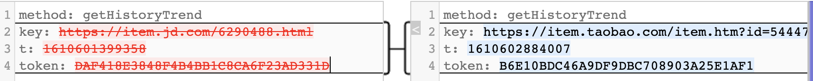

### 请求头报文(Request Header)

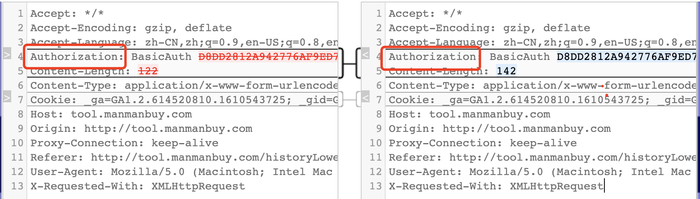

请求头中 Authorization 代表的是 Web端 对访问用户身份的认证，这个知识点，在 [08.确认访问用户身份的认证](./pages/8e336c) 已经写过，Basic Auth 属于一种基本的认证方式，本质上就是通过 Base64 对账户密码进行编码后传输，编码可以通过Base64 反编码，所以本质上就是一种明文的传输方式。所以，我们可以尝试反编译一下。

#### 反编译 Authorization

#### 1. Python 实现 Base64 编码/解码

```python
import base64

def get_basic_auth_str(username, password):
  temp_str = username + ':' + password
  bytesString = temp_str.encode(encoding="utf-8")  # 转成bytes string
  encodestr = base64.b64encode(bytesString)  # base64 编码
  return 'Basic ' + encodestr.decode() 

def decode_basic_auth_str(auth_str):
    bytesString = auth_str.encode("utf-8")
    decode_str = base64.b64decode(bytesString)
    return decode_str.decode("utf-8")


if __name__ == '__main__':
    auth_str = get_basic_auth_str('Tom', 'test') # Basic VG9tOnRlc3Q=
    decode_str = decode_basic_auth_str('VG9tOnRlc3Q=') # Tom:test
```

尝试通过 Base64 去反编译加密后的字符串，发现解析错误。

```python
>>> from util import decode_basic_auth_str                                                                          
>>> decode_basic_auth_str('D8DD2812A942776AF9ED750C2D6D7539BF204F7C0B0FB414E6CEBD28536A99D07304FA7BFFBB2BDD6B9B46823A9D19FA751316693F17DD79FF26D70E2EBA1BF31918AB09FC305FCFF5CC0120F0A255CA5D37BDC0EBFFB3CD')   
>>> UnicodeDecodeError: 'utf-8' codec can't decode byte 0xc0 in position 1: invalid start byte
```

#### 2. 在线Base编码/解码网站

通过在线编码解码网站也是发现全部都是乱码

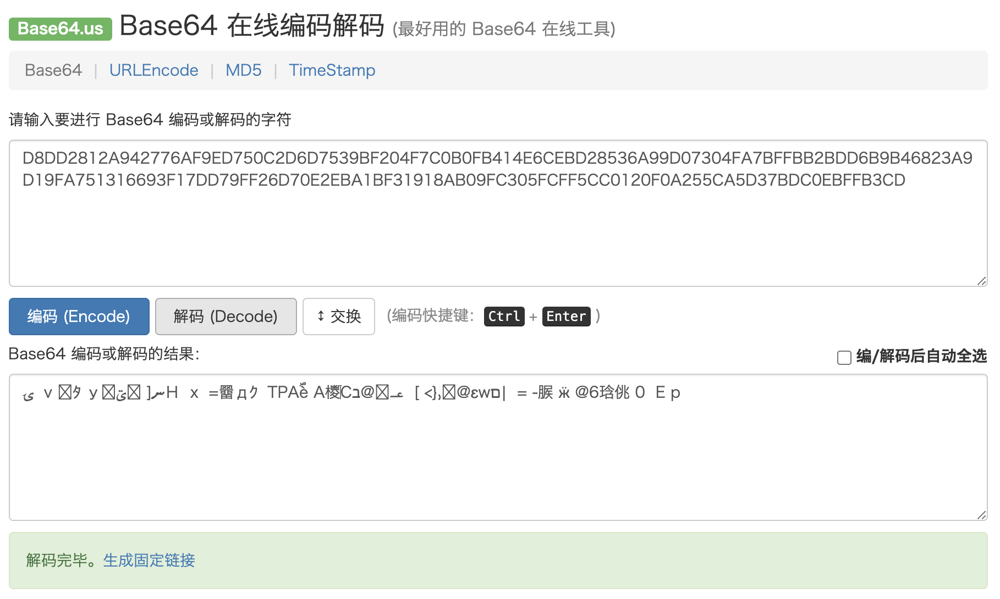


#### 结论

经过代码比较后，我们发现有两个字段无法解决

- Authorization 不是通过传统的 Basic64 加密的
- token


## JS代码分析

知道了目标，就可以查看具体发送请求的地方，以及 Authorization 和 token 生成的逻辑。

首先，查看 `/api.aspx` 是哪里发送出来的

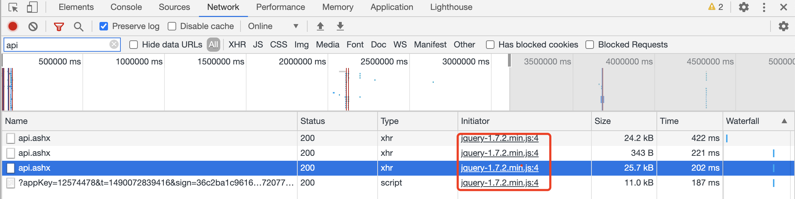

然后，可以通过打上断点，查找发送数据的代码。但是这里并不是拼接数据的地方。

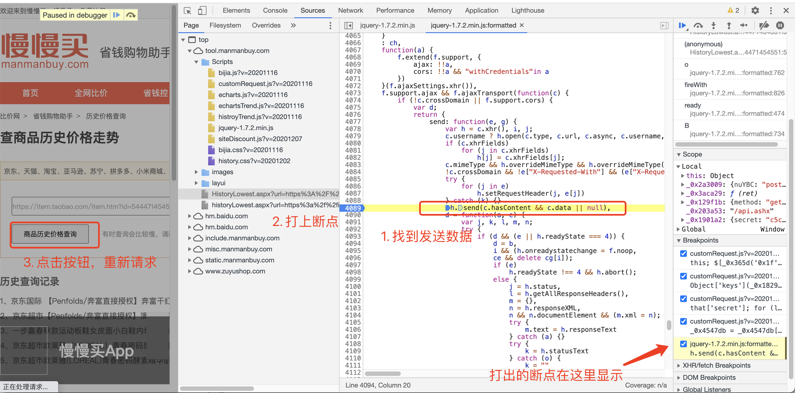

在 Call Stack 调用栈中，不断的向上排查，最终找到拼接数据的地方，可以看出 ajaxpost 这里是真正拼接数据的地方。

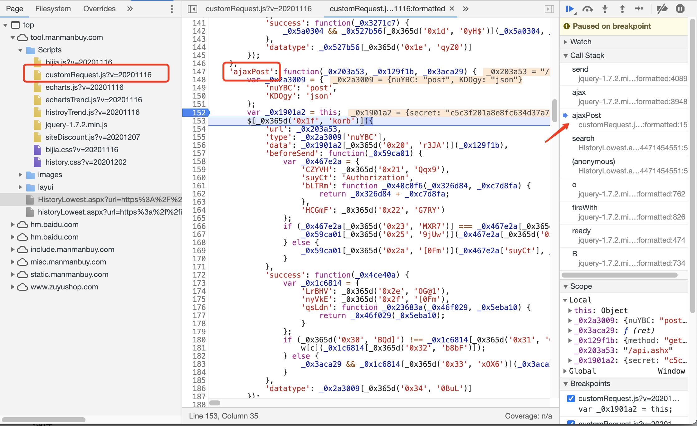

在调试中，找到了 `form data` 的数据

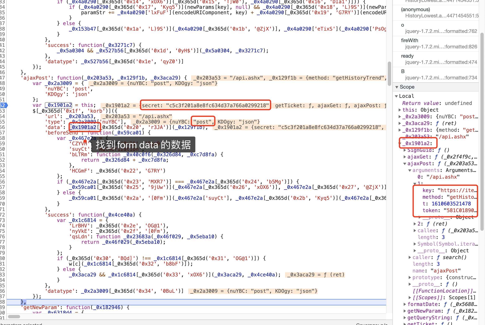

找到了数据后，才发现真正难的地方，这里的 JavaScript 代码都是经过加密的，由于不知道函数和变量的含义，去破解 token 和 Authorization 字段无从下手。

如这段代码，变量名都是通过 `_0x365d()` 函数，加密过了，只要我们破解这个函数即可还原。 

```javascript
'success': function(_0x4ce40a) {
    var _0x1c6814 = {
      'LrBHV': _0x365d('0x2e', 'OG@1'),
      'nyVkE': _0x365d('0x2f', '[0Fm'),
      'qsLdn': function _0x23683a(_0x46f029, _0x5eba10) {
        return _0x46f029(_0x5eba10);
      }
    };
    if (_0x365d('0x30', 'BQd]') !== _0x1c6814[_0x365d('0x31', 'OG@1')]) {
      w[c](_0x1c6814[_0x365d('0x32', 'b8bF')]);
    } else {
      _0x3aca29 && _0x1c6814[_0x365d('0x33', 'xOX6')](_0x3aca29, _0x4ce40a);
    }
  }
```

下面我们看看这段加密代码，发现有70多行，手动破解太费劲了。

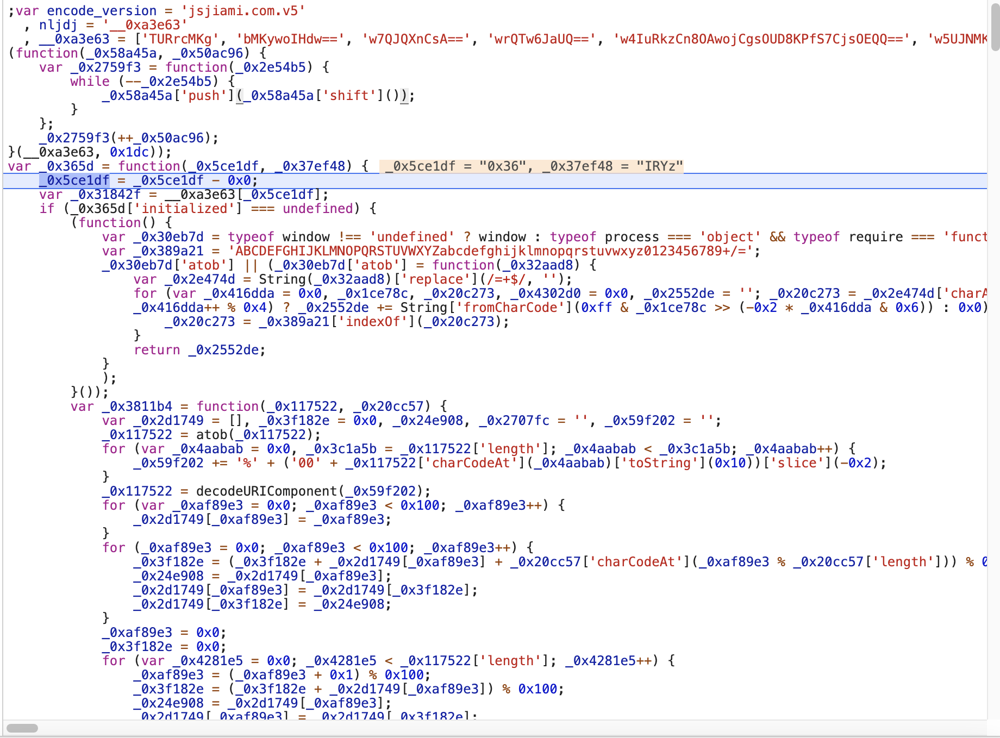

而且通过 `encode_version` 发现，这是使用 jsjiami.com 做的加密。

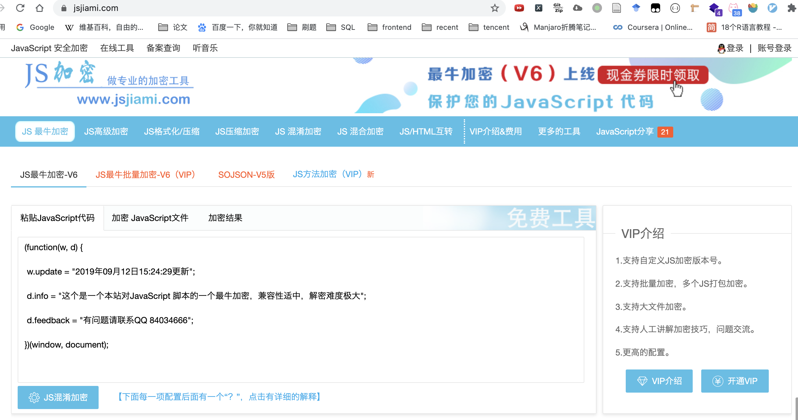

首先，要先把 js 代码调试出来

```javascript
var window = undefined; // 因为 node.js 没有 window，可以先至为 undefined
var encode_version = 'jsjiami.com.v5',
	nljdj = '__0xa3e63',
	__0xa3e63 = ['TURrcMKg', 'bMKywoIHdw==', ...];
(function (_0x58a45a, _0x50ac96) {...}(__0xa3e63, 0x1dc));
var _0x365d = function (_0x5ce1df, _0x37ef48) {...};
                                               
console.log(_0x365d('0x22', 'G7RY')) //  输出 BasicAuth                                   
```

这里使用 `execjs` 和 正则表达式 去解析 JavaScript 文件

```python
import re, execjs

def callJsFunc(s, func=""):
    """ 调用 js 函数"""
    v1, v2 = s.group(1), s.group(2)
    return "'{}'".format(ctx.eval('_0x365d(%s, %s)' %(v1, v2)))

# 加密的 js 文件
with open("customRequest.js", "r", encoding="utf-8") as fr:
    raw_code = fr.read()
    ctx = execjs.compile(raw_code)
# 正则匹配出，两个输入参数
pattern = re.compile(r"_0x365d\(('.*?'), ('.*?')\)", re.S)
trans_code = re.sub(pattern, callJsFunc, raw_code)

# 输出解密文件
with open('customRequest_trans.js', 'w', encoding="utf-8") as fw:
    fw.write(trans_code)
```

> 原 JavaScript 文件：https://github.com/PPsteven/manmanbuy_js_crack/blob/master/customRequest.js
>
> 破解后的 JavaScript 文件：https://github.com/PPsteven/manmanbuy_js_crack/blob/master/customRequest_trans_%E8%BD%AC%E7%A0%81.js

## token 参数还原

翻译的 JavaScript 代码

```javascript
'getNewParam': function (_0x182946) { // 令 _0x182946 为 item
        var _0x6318d4 = {
            'XMcLK': function _0x53fadd(_0x53992b, _0x1be977) { 
                return _0x53992b !== _0x1be977;
            },
            'DCftw': 'QyP',
            'rzOuq': 'WgI',
            'NpXrl': function _0x1baebf(_0x37086b, _0x2b1ab6) { // 不等于
                return _0x37086b != _0x2b1ab6;
            },
            'XAMWs': function _0x3d56be(_0x2aa348, _0x2f1927) { // 不等于
                return _0x2aa348 != _0x2f1927;
            },
            'coWgu': function _0x384c4f(_0x34042d, _0x166417) { // 相加
                return _0x34042d + _0x166417;
            },
            'MDcDl': function _0x353cf4(_0x1134d4, _0xcc855d) { // 函数调用
                return _0x1134d4(_0xcc855d);
            },
            'cOInn': function _0x1e4877(_0x532487, _0x49bb94) { // 相加
                return _0x532487 + _0x49bb94;
            }
        };
        that = this; 
        _0x182946['t'] = new Date()['valueOf'](); // 获取当前时间戳: item['t'] = 1608129001120
        let _0x1a4f89 = Object['keys'](_0x182946)['sort'](); // 按照 key 排序: keys = item['keys'].sort()
        let _0x3a63ba = {};
        _0x1a4f89['forEach'](_0x138605 => {
            var _0x50fa23 = { // 无意义
                'XImOu': function _0xd5995c(_0x950655, _0x4002ed) {
                    return _0x950655 !== _0x4002ed;
                },
                'vsytw': 'KaZ'
            };
            if (_0x50fa23['XImOu'](_0x50fa23['vsytw'], _0x50fa23['vsytw'])) { } else { 
                  // 一定是False, 执行本行
                _0x3a63ba[_0x138605] = _0x182946[_0x138605]; // _0x182946 按照 key 依次赋值到 _0x3a63ba；令 _0x3a63ba 为 newItem
            }
        });
  			// forEach(key => keys) {
  			//		newItem[key] = item[key]
        // }
        var _0x4547db = that['secret'];
        for (let _0x3c07c9 in _0x3a63ba) {
            if (_0x6318d4['XMcLK']('QyP', 'WgI')) { // 一定是True
                // if data[key] != null && data[key] != ''
                if (_0x6318d4['NpXrl'](_0x3a63ba[_0x3c07c9], null) && _0x6318d4['XAMWs'](_0x3a63ba[_0x3c07c9], '')) { 
                    // secret += urlencode(key) + urlencode(data[key])
                    _0x4547db += _0x6318d4['coWgu'](_0x6318d4['MDcDl'](encodeURIComponent, _0x3c07c9), encodeURIComponent(_0x3a63ba[_0x3c07c9])); 
                }
            } else {
                date = _0x6318d4['cOInn']('0', date);
            }
        }
        _0x4547db += that['secret']; // data += that['secret']
        _0x4547db = _0x4547db['toUpperCase'](); // data.toUpperCase()
        var _0x20fdfc = hex_md5(_0x4547db)['toUpperCase'](); // hex_md5(data)
        _0x182946['token'] = _0x20fdfc;
        return _0x182946;
    }
```

下面是翻译的 Python 代码

```python
import time
from urllib.parse import quote
import hashlib
import collections

post_data = {
    'method': 'getHistoryTrend',
    'key': 'http://item.jd.hk/10429555538.html',
    't': str(int(time.time() * 100000))[:13] # 13 位时间戳
}
post_data = collections.OrderedDict( # 按照 key 排序
    sorted(post_data.items(),
           key=lambda x: x[0])
)


secret = 'c5c3f201a8e8fc634d37a766a0299218' # secret 不变
token = secret
for k, v in post_data.items():
    token += quote(k, safe='') + quote(v, safe='') # Python 默认不转义 //,这个必须删掉
token += secret
token = token.upper() # 转成大写
m = hashlib.md5()
m.update(token.encode('utf-8')) # 生成 md5 码
token = m.hexdigest().upper()
post_data['token'] = token # 添加 token 
print(post_data)
```

## Authorization 破解

```javascript
'beforeSend': function(_0x59ca01) {
				var _0x467e2a = {
					'CZYVH': 'vBP',
					'suyCt': 'Authorization',
					'bLTRm': function _0x40c0f6(_0x326d84, _0xc7d8fa) {
						return _0x326d84 + _0xc7d8fa;
					},
					'HCGmF': 'BasicAuth '
				};
				if (_0x467e2a['CZYVH'] === _0x467e2a['CZYVH']) {
           // 一定执行本行
					_0x59ca01['setRequestHeader'](_0x467e2a['suyCt'], _0x467e2a['bLTRm'](_0x467e2a['HCGmF'], _0x1901a2['getTicket']()));
					// _0x59ca01['setRequestHeader']('Authorization', 'BasicAuth ' + this.getTicket())
        } else {
					_0x59ca01['setRequestHeader'](_0x467e2a['suyCt'], _0x467e2a['bLTRm'](_0x467e2a['HCGmF'], _0x1901a2['getTicket']()));
				}
			}
```

getTicket 函数

```javascript
   ... 
   'secret': 'c5c3f201a8e8fc634d37a766a0299218',
	 'getTicket': function() {
		var _0x3bc08f = {
			'ipeUV': function _0x5ef1ae(_0x41239c, _0x1e50a1) { // a(b)
				return _0x41239c(_0x1e50a1);
			},
			'ZadZx': function _0x13f13f(_0x34a3cb, _0x22d7b9) { // a > b
				return _0x34a3cb > _0x22d7b9;
			},
			'XDmmn': function _0x5cd9f2(_0x47ada5, _0x170387) { // a + b 
				return _0x47ada5 + _0x170387;
			},
			'HxAAK': function _0x18276a(_0x1835fa, _0x2d0f0b) { // a - b 
				return _0x1835fa - _0x2d0f0b;
			},
			'DLUkx': function _0x149149(_0x200e47, _0x1da274) { // a - b
				return _0x200e47 - _0x1da274;
			}
		};
		var _0x3f166f = _0x3bc08f['ipeUV']($, '#ticket')['val'](); // ticket = $(#ticket).val
		if (_0x3bc08f['ZadZx'](_0x3f166f['length'], 0x4)) {  // if len(ticket) > 4 
       // ticket = substr[lenght(ticket) - 4, 4] + substr[0, length(ticket) - 4 ]
			_0x3f166f = _0x3bc08f['XDmmn'](_0x3f166f['substr'](_0x3bc08f['HxAAK'](_0x3f166f['length'], 0x4), 0x4), _0x3f166f['substring'](0x0, _0x3bc08f['DLUkx'](_0x3f166f['length'], 0x4)));
		}
		return _0x3f166f;
	},
```

上面的代码就很简单

- 首先从 http://tool.manmanbuy.com/HistoryLowest.aspx 获取 `#ticket` 元素的值
- ticket 向右循环4个字母，即abcdefgh 变成 efghabcd

Python 翻译代码

```python
def create_auth():
    req = requests.get('http://tool.manmanbuy.com/HistoryLowest.aspx')
    if req.status_code == 200:
        history_price_html = req.text
        searchRet = re.search(r'id="ticket".+value="(?P<value>.+)"', history_price_html)
        if not searchRet:
            return ''
        ticket = searchRet.group('value')

        return 'BasicAuth ' + ticket[-4:] + ticket[:-4]
    return ''
```

## Github 仓库

[manmanbuy_js_crack](https://github.com/PPsteven/manmanbuy_js_crack)

## 参考资料

[某 JS 加密逆向还原简单分析](https://www.myitmx.com/96.html)


